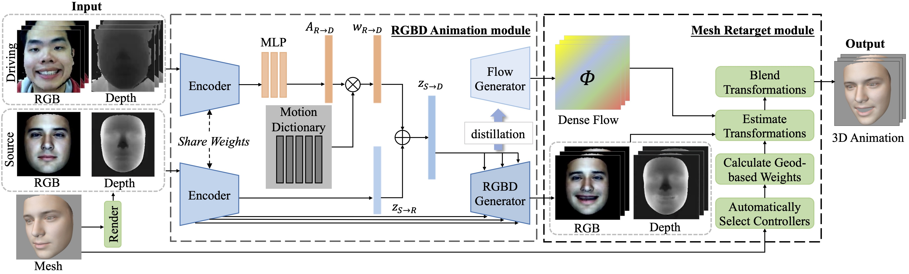

# Versatile Face Animator: Driving Arbitrary 3D Facial Avatar in RGBD Space

### [Paper](https://arxiv.org/abs/2308.06076)

This is the official PyTorch implementation of the ACM Multimedia 2023 paper "Versatile Face Animator: Driving Arbitrary 3D Facial Avatar in RGBD Space"



<div align=center></div>

## Installation

* Create virtual environment via anaconda or miniconda:

```
conda create -n vfa python=3.8
conda activate vfa
```

* Install necessary packages through `pip install -r requirements.txt`
* Download the pretrained checkpoint model and `BFM09_model_info.mat` from the [Google Drive](https://drive.google.com/drive/folders/19zRZO0J2VPMIK32ddGq9zf77XF1JEHha?usp=sharing) or [Tsinghua Cloud](https://cloud.tsinghua.edu.cn/d/b257a8f8b9534ba6a7e8/), put the checkpoint into `./save_models/VFA`, and put the BFM data into `./BFM`

## Inference

### Use provided data

We have provided several demo source data and driving videos in `./dataset`. The video is recorded by [Record3D](https://record3d.app/), and the source data are BFM coefficients or obj file.

To obtain demos, you could run following commands, generated results will be saved under `./results`.

```shell
python infer.py --checkpoint saved_models/VFA/VFA.pt --source_path dataset/demo_source/woman.npy --driving_path dataset/demo_driving/color/output.mp4 --calc_weights
```

### Use your own data

If you want to generate animation with your own data, you need to follow these steps:

* **Preprocess**: We provide a script `dataset/preprocess.py` for preprocess, which is consist of face detection,  background removal, image crop, image normalization. 

  Your input data must be a 8-bit video (the left half should contain depth and the right half should contain color), or a directory(recommend) like:

  ```
  |-- demo_driving
  	|-- depth
  		|-- 0.exr
  		|-- 1.exr
  		|-- ...
  	|-- rgb
  		|-- 0.jpg
  		|-- 1.jpg
  		|-- ...
  ```

* **Adjust camera**: You might need to change the camera position to get a better rendered view. Check the view by add `--adjust_camera` while running the scripts, and change the config by changing `eye` and `translation`.

  ```shell
  python infer.py --driving_path dataset/demo_driving/color/output.mp4 --checkpoint saved_models/VFA/VFA.pt --source_path dataset/demo_source/woman.npy --adjust_camera --translation 0. 0. 0. --eye 0. 0. 8.
  ```

* **Calculate controlling weights**: You need to calculate the controlling weights if you would like to drive a new avatar. Calculated weights will be stored in `./weights` after the first calculation, and you can remove `--calc_weights`.

  ```shell
  python infer.py --driving_path dataset/demo_driving/color/output.mp4 --checkpoint saved_models/VFA/VFA.pt --source_path dataset/demo_source/woman.npy --calc_weights
  ```

* **Run!**


## Train

### Datasets

#### MMFace4D

Our model is trained on [MMFace4D](https://arxiv.org/abs/2303.09797). We use [Mediapipe](https://developers.google.com/mediapipe) to detect and crop the facial region,  resize them to 256*256, remove the outliers of the depth frames, and store the depth frames with 16 bit videos (`.nut`). The dataset is organized as follows:

```
|-- train
    |-- people1
        |-- color
          |-- video1.mp4
          |-- video2.mp4
          |-- ...
        |-- depth
          |-- video1.nut
          |-- video2.nut
          |-- ...
    |-- people2
        |-- color
        |-- depth
    |-- ...
|-- test
```

#### Kinect_data

Our model can also be trained or fine-tuned on RGBD videos captured by Azure Kinect. In practice, we use [Kinect SDK](https://learn.microsoft.com/en-us/azure/kinect-dk/use-image-transformation) to transform depth images to color camera, and then use [BackgroundMattingV2](https://github.com/PeterL1n/BackgroundMattingV2) to remove the background. The following steps are the same as what we do on `MMFace4D`. 

### Training scripts

By default, we use `DistributedDataParallel` for all datasets. To train the netowrk, run

```shell script
python train.py --exp_path <EXP_PATH> --exp_name <EXP_NAME>
```

To train from a checkpoint, run

```shell script
python train.py --exp_path <EXP_PATH> --exp_name <EXP_NAME> --resume_ckpt <CHECKPOINT_PATH>
```

After training the encoder and the RGBD generator, you need to add `--distilling` to train the flow generator

```shell script
python train.py --exp_path <EXP_PATH> --exp_name <EXP_NAME> --resume_ckpt <CHECKPOINT_PATH> --distilling
```

## Citation

If you find this code useful for your research, please consider citing our paper:

```bibtex
@inproceedings{
wang2023versatile,
title={Versatile Face Animator: Driving Arbitrary 3D Facial Avatar in RGBD Space},
author={Haoyu Wang, Haozhe Wu, Junliang Xing, Jia Jia},
booktitle={Proceedings of the 31th ACM International Conference on Multimedia},
year={2023}
}
```

## Acknowledgement

Part of the code is adapted from [LIA](https://github.com/wyhsirius/LIA) and [3DMM-Fitting-Pytorch](https://github.com/ascust/3DMM-Fitting-Pytorch). We thank authors for their contribution to the community.